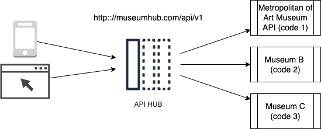

# tp-api

# Goal overview

Goal is to create a Hub API to access to objects across several museums API. It's a backend application that expose an API and make the usage of other API easier. First musuem is the Metropolitan of Art Museum API.

A request from a client application should be:

> Client application > YOUR NEW API > existing Metropolitan of Art Museum API

You would have to:

* Design "YOUR NEW API" to make new enpoints available. Those new endpoints aim to simplify the call of API museum
* Generates code in order to create a server (Python)
* Integrate the generated API in a Python flask template
* Make your application up and running locally

# Materials

- The Swagger editor at https://editor.swagger.io
- The metropolitan of Art Museum API documentation:  https://metmuseum.github.io
- Python on your computer
 
# Step 1: Think the API

Existing API of New York Museum has several endpoints we can use to create a search engine. At least two steps are mandatory:

- make a GET operation on "search" to get a list of objects ID (https://metmuseum.github.io/#search)
- make several GET operation on "objects/[objectID]" with each ID in search result (https://metmuseum.github.io/#object)

## Your Goal

Make a proposal for a new API which is able to make a search in one request. You have to get some considerations into account:

- the request must have parameters to limit the number of result and browse into result (offest and limit)
- plan a standard response format
- plan also an error response format if parameters are wrong

# Step 2: Design the API with Swagger

# Step 3: Generate the code and analyse it

# Step 4: Create a Python application

# Step 5: Integrate the generated API

# Step 6: Run the application

# Step 7: Create mocks to simulate the Museum API

# Step 8: Test your application with POSTMAN

# Step 9: Change mock to call the museum
